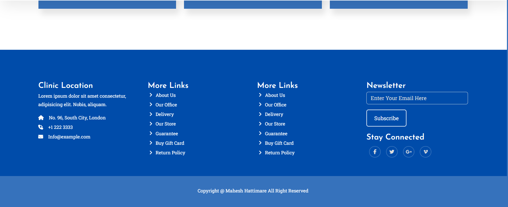

# Doctor Clinic Website

A simple and interactive Doctor Clinic Website built with Bootstrap 5, HTML, CSS, and JavaScript.

## Visit the Website

[Doctor Clinic Website](https://maheshhattimare.github.io/doctor-clinic-website/)

## Features

- User-friendly interface
- Responsive design
- Interactive elements

## Technologies Used

- HTML
- CSS
- JavaScript
- Bootstrap 5

## Screenshots

### Homepage


### Footer Page


## Installation

1. Clone the repository:
    ```bash
    git clone https://github.com/maheshhattimare/doctor-clinic-website.git
    ```
2. Navigate to the project directory:
    ```bash
    cd doctor-clinic-website
    ```
3. Open `index.html` in your web browser to start the application.

## Usage

1. Open the `index.html` file in your preferred web browser.
2. Explore the homepage and other pages to learn about the services offered.
